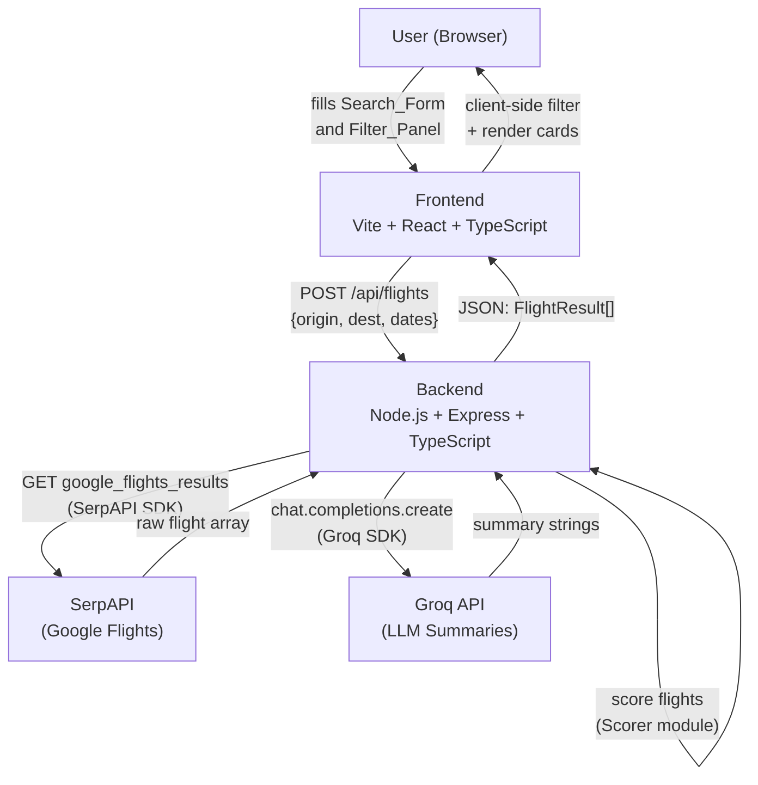

# Design Document: Flight Finder

## Overview

Flight Finder is a full-stack single-page application that lets travelers search, filter, score, and summarize flights. The user enters a route and dates in a React frontend; the TypeScript/Express backend fetches live data from SerpAPI (Google Flights), scores each result with a deterministic formula, generates plain-English summaries via the Groq API, and returns a ranked JSON array to the frontend.

This document replaces the original Python backend design with a TypeScript (Node.js + Express) backend, keeping the same product requirements.

### Key Design Decisions

- **TypeScript everywhere** — shared type definitions can be imported by both frontend and backend, eliminating drift between API shapes.
- **Client-side filtering** — filters (price, duration, red-eye) are applied in the browser after the initial fetch, avoiding redundant SerpAPI calls.
- **Deterministic scoring** — the Scorer is a pure function with no AI involvement, making it fast, testable, and reproducible.
- **Groq for summaries only** — the LLM is never in the scoring path; it only generates human-readable text after scores are computed.
- **Single POST endpoint** — the frontend talks to one endpoint (`POST /api/flights`), keeping the API surface minimal for a hackathon timeline.

---

## Architecture

### System Flow



### Component Layers

```
frontend/src/
  components/
    SearchForm.tsx       — origin, destination, dates
    FilterPanel.tsx      — max price, max duration, no-red-eye toggle
    FlightCard.tsx       — single result card with badge logic
    FlightList.tsx       — renders sorted, filtered FlightCard list
    LoadingSkeleton.tsx  — placeholder cards during fetch
  hooks/
    useFlightSearch.ts   — fetch logic, loading/error state
    useFlightFilter.ts   — client-side filter logic
  types/
    flight.ts            — shared TypeScript interfaces (mirrored in backend)
  App.tsx

backend/src/
  index.ts               — Express app entry point, env validation
  routes/
    flights.ts           — POST /api/flights route handler
  services/
    serpapi.ts           — SerpAPI integration
    scorer.ts            — deterministic scoring formula
    summarizer.ts        — Groq API integration
  types/
    flight.ts            — canonical TypeScript interfaces
  middleware/
    cors.ts              — CORS configuration
    errorHandler.ts      — global error handler
```

---

## Components and Interfaces

### Frontend Components

**`SearchForm`**
- Props: `onSearch: (params: SearchParams) => void`
- State: `origin`, `destination`, `departureDate`, `returnDate`, `errors`
- Validates required fields before calling `onSearch`; shows inline error messages per field

**`FilterPanel`**
- Props: `filters: FilterState`, `onChange: (filters: FilterState) => void`
- Controlled component; parent holds filter state and passes it down

**`FlightList`**
- Props: `flights: FlightResult[]`, `loading: boolean`, `error: string | null`
- Renders `LoadingSkeleton` when `loading`, error message when `error`, or sorted `FlightCard` list

**`FlightCard`**
- Props: `flight: FlightResult`, `isBestPick: boolean`
- Displays all fields; renders "Best Pick" badge when `isBestPick` is true

**`useFlightSearch` hook**
- Manages `flights`, `loading`, `error` state
- Calls `POST /api/flights` and stores raw results
- Raw results are never re-fetched on filter change

**`useFlightFilter` hook**
- Takes `flights: FlightResult[]` and `filters: FilterState`
- Returns filtered and sorted subset — pure computation, no side effects

### Backend Services

**`serpapi.ts`** — `fetchFlights(params: SearchParams): Promise<RawFlight[]>`
Wraps the SerpAPI `google_flights` engine. Maps raw SerpAPI response fields to `RawFlight`.

**`scorer.ts`** — `scoreFlights(flights: RawFlight[]): ScoredFlight[]`
Pure function. Normalizes price, duration, stops across the result set, then computes a weighted sum.

**`summarizer.ts`** — `summarizeFlights(flights: ScoredFlight[]): Promise<FlightResult[]>`
Calls Groq API once per flight (or in a batched prompt). Attaches `summary` string to each flight. Falls back to a plain-text template on API failure.

---

## Data Models

### Shared TypeScript Interfaces

```typescript
// Canonical search parameters (frontend → backend)
interface SearchParams {
  origin: string;          // IATA code or city name, e.g. "JFK"
  destination: string;     // IATA code or city name, e.g. "LAX"
  departureDate: string;   // ISO 8601 date, e.g. "2025-09-01"
  returnDate?: string;     // ISO 8601 date, optional for one-way
}

// Client-side filter state (never sent to backend)
interface FilterState {
  maxPrice: number | null;     // USD
  maxDurationHours: number | null;
  noRedEye: boolean;
}

// Raw flight data from SerpAPI (internal backend type)
interface RawFlight {
  airline: string;
  price: number;           // USD
  departureTime: string;   // "HH:MM" local time
  arrivalTime: string;     // "HH:MM" local time
  durationMinutes: number; // integer
  stops: number;           // 0 = nonstop
}

// After scoring (internal backend type)
interface ScoredFlight extends RawFlight {
  score: number;           // 0.0 – 1.0, higher is better
}

// Final shape returned by POST /api/flights
interface FlightResult extends ScoredFlight {
  summary: string;         // plain-English AI summary or fallback
}

// API error response shape
interface ApiError {
  error: string;
  field?: string;          // present on 400 validation errors
}
```

### SerpAPI Request Shape

```typescript
// Parameters passed to SerpAPI google_flights engine
interface SerpApiParams {
  engine: "google_flights";
  departure_id: string;    // origin IATA
  arrival_id: string;      // destination IATA
  outbound_date: string;   // YYYY-MM-DD
  return_date?: string;    // YYYY-MM-DD, omit for one-way
  currency: "USD";
  hl: "en";
  api_key: string;
}
```

### Groq API Request Shape

```typescript
// One call per flight (or batched)
interface GroqSummaryRequest {
  model: "llama3-8b-8192";   // fast, low-latency model
  messages: [
    {
      role: "system";
      content: string;       // instruction prompt
    },
    {
      role: "user";
      content: string;       // flight data as structured text
    }
  ];
  max_tokens: 120;           // ~3 sentences
  temperature: 0.4;
}
```

---

## Scoring Formula Design

The Scorer is a pure TypeScript function with no external dependencies.

### Normalization

For each factor `f` across all `n` flights, the normalized value is:

```
normalized_f(i) = (max_f - f_i) / (max_f - min_f)   if max_f != min_f
                = 1.0                                  if all values are equal
```

This maps the best value (lowest price, shortest duration, fewest stops) to `1.0` and the worst to `0.0`.

### Weighted Sum

```
score(i) = w_price * norm_price(i)
         + w_duration * norm_duration(i)
         + w_stops * norm_stops(i)
```

Default weights (sum to 1.0):

| Factor   | Weight |
|----------|--------|
| price    | 0.50   |
| duration | 0.30   |
| stops    | 0.20   |

Weights are defined as constants in `scorer.ts` and can be adjusted without changing the algorithm.

### Implementation Sketch

```typescript
const WEIGHTS = { price: 0.50, duration: 0.30, stops: 0.20 };

function normalize(values: number[]): number[] {
  const min = Math.min(...values);
  const max = Math.max(...values);
  if (max === min) return values.map(() => 1.0);
  return values.map(v => (max - v) / (max - min));
}

export function scoreFlights(flights: RawFlight[]): ScoredFlight[] {
  const normPrice    = normalize(flights.map(f => f.price));
  const normDuration = normalize(flights.map(f => f.durationMinutes));
  const normStops    = normalize(flights.map(f => f.stops));

  return flights.map((f, i) => ({
    ...f,
    score: parseFloat((
      WEIGHTS.price    * normPrice[i] +
      WEIGHTS.duration * normDuration[i] +
      WEIGHTS.stops    * normStops[i]
    ).toFixed(4)),
  }));
}
```

---

## API Specification

### `POST /api/flights`

**Request**

```
Content-Type: application/json
```

```json
{
  "origin": "JFK",
  "destination": "LAX",
  "departureDate": "2025-09-01",
  "returnDate": "2025-09-08"
}
```

| Field           | Type   | Required | Description                        |
|-----------------|--------|----------|------------------------------------|
| `origin`        | string | yes      | Origin airport/city                |
| `destination`   | string | yes      | Destination airport/city           |
| `departureDate` | string | yes      | ISO 8601 date                      |
| `returnDate`    | string | no       | ISO 8601 date; omit for one-way    |

**Success Response — 200 OK**

```json
[
  {
    "airline": "Delta",
    "price": 289,
    "departureTime": "08:15",
    "arrivalTime": "11:40",
    "durationMinutes": 325,
    "stops": 0,
    "score": 0.8712,
    "summary": "A solid nonstop option at $289 — the cheapest in this search. Arrives mid-morning with a 5h 25m flight time."
  }
]
```

**Error Responses**

| Status | Condition                              | Body                                          |
|--------|----------------------------------------|-----------------------------------------------|
| 400    | Missing required field                 | `{ "error": "Missing field", "field": "origin" }` |
| 500    | SerpAPI or Groq key not configured     | `{ "error": "SERP_API_KEY is not set" }`      |
| 502    | SerpAPI returned an error              | `{ "error": "SerpAPI error: <message>" }`     |
| 500    | Unexpected server error                | `{ "error": "Internal server error" }`        |

---

## Environment Variables

All secrets and configuration are loaded from a `.env` file at the backend root. The backend validates these on startup and returns a 500 if any required variable is missing.

| Variable           | Required | Description                                      |
|--------------------|----------|--------------------------------------------------|
| `SERP_API_KEY`     | yes      | SerpAPI key for Google Flights queries           |
| `GROQ_API_KEY`     | yes      | Groq API key for LLM summary generation          |
| `PORT`             | no       | HTTP port (default: `3001`)                      |
| `FRONTEND_ORIGIN`  | no       | CORS allowed origin (default: `http://localhost:5173`) |

The frontend uses a single variable:

| Variable           | Required | Description                                      |
|--------------------|----------|--------------------------------------------------|
| `VITE_API_URL`     | no       | Backend base URL (default: `http://localhost:3001`) |

---

## Correctness Properties

*A property is a characteristic or behavior that should hold true across all valid executions of a system — essentially, a formal statement about what the system should do. Properties serve as the bridge between human-readable specifications and machine-verifiable correctness guarantees.*

### Property 1: Form validation rejects incomplete submissions

*For any* combination of missing required fields (origin, destination, or departure date), submitting the Search_Form should not trigger a network request, and an inline error should be present for each missing field.

**Validates: Requirements 1.3**

---

### Property 2: Results are displayed in descending score order

*For any* array of `FlightResult` objects returned by the backend, the order in which they are rendered by `FlightList` should be non-increasing by `score`.

**Validates: Requirements 1.4**

---

### Property 3: Filter exclusion is correct for all filter types

*For any* set of flight results and any combination of active filters (max price, max duration, no-red-eye), every flight in the filtered output should satisfy all active filter constraints simultaneously — price ≤ maxPrice, durationMinutes ≤ maxDurationHours × 60, and departureTime outside 22:00–05:59 when noRedEye is enabled.

**Validates: Requirements 2.2, 2.3, 2.4, 2.5**

---

### Property 4: Scorer monotonicity

*For any* two flights that are identical except for one factor (price, duration, or stops), the flight with the strictly better value for that factor (lower price, shorter duration, fewer stops) should receive a strictly higher score.

**Validates: Requirements 3.2, 3.3, 3.4**

---

### Property 5: Scorer normalization bounds

*For any* non-empty set of flights, after scoring, all intermediate normalized factor values should be in the range [0.0, 1.0], and all final scores should be in the range [0.0, 1.0].

**Validates: Requirements 3.1, 3.5**

---

### Property 6: Every flight result has a non-empty summary

*For any* array of `FlightResult` objects returned by the backend (including when Groq fails and the fallback is used), every element should have a non-empty `summary` string.

**Validates: Requirements 4.1, 4.4**

---

### Property 7: Summary length is one to three sentences

*For any* summary string generated by the Summarizer (excluding fallback), the number of sentences (split on `.`, `!`, `?`) should be between 1 and 3 inclusive.

**Validates: Requirements 4.3**

---

### Property 8: Backend response contract

*For any* valid `POST /api/flights` request, every object in the returned JSON array should contain all required fields (`airline`, `price`, `departureTime`, `arrivalTime`, `durationMinutes`, `stops`, `score`, `summary`), `price` should be a positive number, and `durationMinutes` should be a positive integer.

**Validates: Requirements 5.2, 5.6**

---

### Property 9: Backend rejects missing required parameters

*For any* request to `POST /api/flights` that omits one or more of `origin`, `destination`, or `departureDate`, the backend should respond with HTTP 400 and a JSON body containing an `error` field and a `field` field identifying the missing parameter.

**Validates: Requirements 5.3**

---

### Property 10: Flight card renders all required fields

*For any* `FlightResult` object, the rendered `FlightCard` component should contain visible text for airline, price, departure time, arrival time, duration, stops, score, and summary.

**Validates: Requirements 6.1**

---

### Property 11: Exactly one "Best Pick" badge per result set

*For any* non-empty array of `FlightResult` objects rendered by `FlightList`, exactly one `FlightCard` should display the "Best Pick" badge, and it should be the card with the highest `score`.

**Validates: Requirements 6.2**

---

## Error Handling

### Backend

| Layer        | Error                          | Handling                                                                 |
|--------------|--------------------------------|--------------------------------------------------------------------------|
| Startup      | Missing env vars               | Log descriptive message, exit process (or return 500 on first request)   |
| Route        | Missing request fields         | Return 400 with `{ error, field }`                                       |
| SerpAPI      | Network error / API error      | Return 502 with `{ error: "SerpAPI error: <msg>" }`                      |
| Scorer       | Empty flight array             | Return empty array `[]` (not an error)                                   |
| Groq API     | Network error / API error      | Log warning, attach fallback summary, continue — do not fail the request |
| Unexpected   | Unhandled exception            | Global error handler returns 500 `{ error: "Internal server error" }`    |

### Frontend

| Scenario                        | Handling                                                        |
|---------------------------------|-----------------------------------------------------------------|
| Network error on fetch          | Set `error` state, display error message in `FlightList`        |
| Backend returns 4xx/5xx         | Parse error body, display message                               |
| Empty results after filtering   | `FlightList` renders "No flights match your filters" message    |
| Groq fallback summary           | Displayed transparently — user sees plain-text summary          |

---

## Testing Strategy

### Dual Testing Approach

Both unit tests and property-based tests are required. Unit tests cover specific examples, integration points, and error conditions. Property tests verify universal correctness across randomized inputs.

### Unit Tests

Focus areas:
- `SearchForm` renders all required fields and shows errors on invalid submit (Requirements 1.1, 1.3)
- `useFlightSearch` sets loading state and calls the correct endpoint (Requirement 1.2)
- `FlightList` renders `LoadingSkeleton` when loading (Requirement 6.3)
- `POST /api/flights` returns 400 for each missing required field (Requirement 5.3)
- `POST /api/flights` returns CORS headers (Requirement 5.5)
- Groq fallback summary contains price, duration, and stops (Requirement 4.4)
- Backend returns 500 when env vars are missing (Requirement 5.4)

### Property-Based Tests

Library: **fast-check** (TypeScript, works in both Node.js and browser environments)

Minimum 100 iterations per property test. Each test is tagged with the property it validates.

| Property | Test Description                                                                 |
|----------|----------------------------------------------------------------------------------|
| P1       | For any missing-field combination, form does not submit and shows errors         |
| P2       | For any FlightResult[], rendered order is non-increasing by score                |
| P3       | For any flights + filters, all filtered results satisfy all active constraints   |
| P4       | For any two flights differing in one factor, better factor → higher score        |
| P5       | For any flight set, all normalized values and scores are in [0.0, 1.0]          |
| P6       | For any flight set (including Groq failure), every result has non-empty summary  |
| P7       | For any Groq-generated summary, sentence count is between 1 and 3               |
| P8       | For any valid request, response objects contain all required fields with correct types |
| P9       | For any request missing a required field, response is 400 with error + field     |
| P10      | For any FlightResult, rendered FlightCard contains all required field values     |
| P11      | For any non-empty FlightResult[], exactly one card has "Best Pick" badge on the highest-scored flight |

**Tag format for each test:**
```typescript
// Feature: flight-finder, Property 4: scorer monotonicity
```

### Test Configuration

```typescript
// fast-check configuration
fc.configureGlobal({ numRuns: 100 });
```

Backend tests use **Vitest** + **supertest**. Frontend tests use **Vitest** + **@testing-library/react**.
